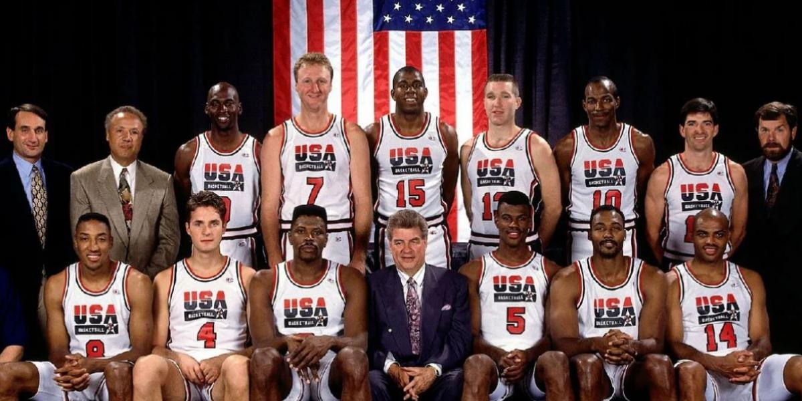

# DREAM TEAM STATISTICS CONSOLE APP

Welcome to the Basketball Statistics Console App! Step into the world of the United States NBA Dream Team, an iconic basketball squad that redefined the sport.

Assembled for the 1992 Summer Olympics in Barcelona, the Dream Team featured NBA legends like Michael Jordan, Magic Johnson, Larry Bird, and many others. They dominated the competition and secured the gold medal, leaving a lasting impact on basketball worldwide.

In this app, you can delve into the team's remarkable statistics, reliving their greatest moments and achievements.

Explore various player stats, rankings, and more as you celebrate the greatness of the United States NBA Dream Team!

Choose an option from the menu to begin your journey into basketball history! Enjoy the experience!

## MENU

The app provides the following options:

1. Show the list of all Dream Team players.
2. Select a player by index and display their complete statistics.
3. Save the selected player's statistics from option 2 to a ".csv" file.
4. Search for a player by name and display their achievements.
5. Get the average points per game of the entire Dream Team, sorted by name in ascending order.
6. Check if a player belongs to the Basketball Hall of Fame.
7. Get the player with the most total rebounds.
8. Get the player with the highest field goal percentage.
9. Get the player with the most total assists.
10. Enter a value and get the players who have averaged more points per game than that value.
11. Enter a value and get the players who have averaged more rebounds per game than that value.
12. Enter a value and get the players who have averaged more assists per game than that value.
13. Get the player with the most total steals.
14. Get the player with the most total blocks.
15. Enter a value and get the players who have had a free throw percentage greater than that value.
16. Get the average points per game of the team, excluding the player with the lowest points per game.
17. Get the player with the most achievements.
18. Enter a value and get the players who have had a three-point percentage greater than that value.
19. Get the player with the most seasons played.
20. Enter a value and get the players, sorted by position on the court, who have had a field goal percentage greater than that value.
21. Calculate the ranking of each player in the following categories:
    - Points
    - Rebounds
    - Assists
    - Steals
    The rankings will be saved to a ".csv" file.
22. (EXTRA) Enter a value and get the players who have played an equal or greater number of All-Star games than that value.
23. (EXTRA) Get the player with the most All-Star games played.
24. (EXTRA) Calculate the ranking of each player in the following categories:
    - Field Goal Percentage
    - Free Throw Percentage
    - Three-Point Percentage
    The rankings will be saved to a ".csv" file.
25. (EXTRA) Get the number of players whose position is Power Forward.
26. (EXTRA) Get names of players whose position is Power Forward.
27. (EXTRA) Get names of players whose position is Point Guard.
28. (EXTRA) Play an additional game where you'll be asked questions about the statistics obtained throughout the menu. Answer the questions to check your knowledge!
29. (EXTRA) If you answered 2 or more questions correctly in the game from option 28, you'll be able to access a certification in a ".txt" file.
30. Get the number of players per position.
31. Get the list of players sorted by the number of All-Star games in descending order.
32. Get the players with the best statistics in each category.
33. Get the player with the best overall statistics.
34. EXIT

Choose the desired option by entering the corresponding number.

## UTN

(Project i made for my first UTN 'Programming I' exam - 2023)

